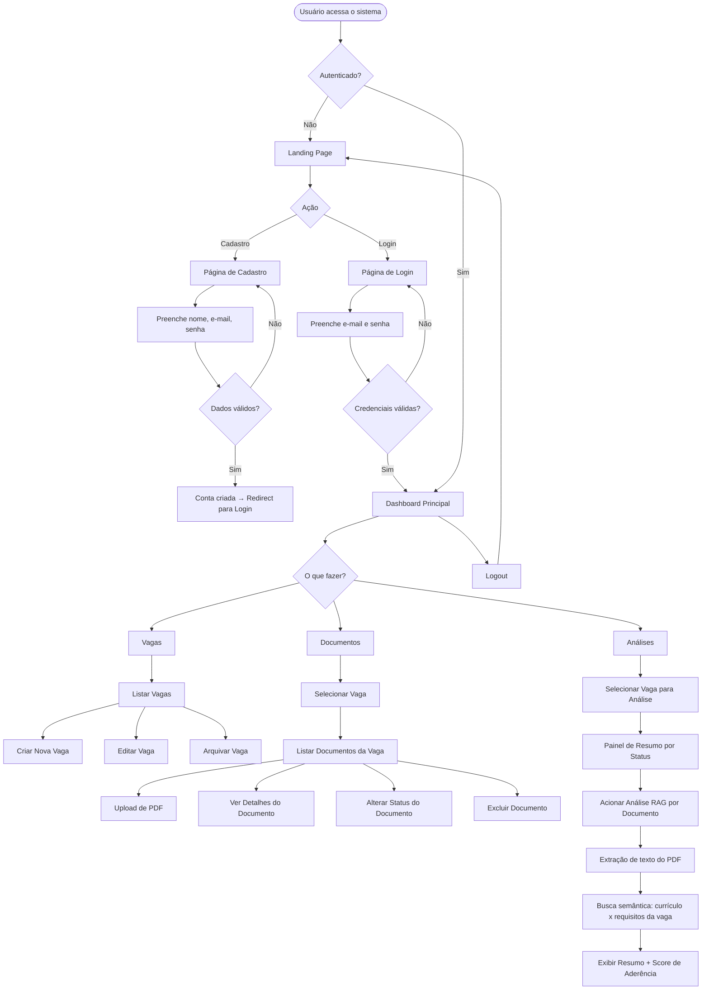
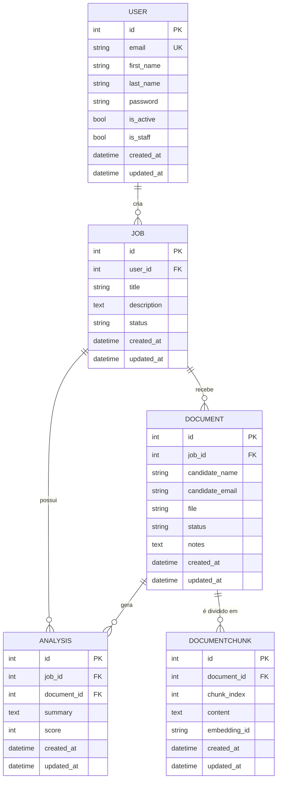

# PRD — Crivopy
### Sistema de Triagem de Currículos e Documentos PDF

> **Versão:** 1.1.0 — Documento vivo, atualizado conforme sprints avançam.

---

## 1. Visão Geral

O **Crivopy** é um sistema web de triagem inteligente de currículos e documentos PDF, desenvolvido com Django full stack. Oferece uma interface moderna, responsiva e com design system coeso, permitindo que recrutadores e gestores de RH organizem, analisem e filtrem candidatos com rapidez e precisão, sem depender de ferramentas externas dispersas.

---

## 2. Sobre o Produto

O Crivopy centraliza o fluxo de recebimento, organização e análise de currículos em PDF. O sistema permite que usuários autenticados façam upload de documentos, os associem a processos seletivos (vagas), e utilizem recursos de análise e filtragem com suporte de inteligência artificial via RAG (Retrieval-Augmented Generation) para identificar os candidatos mais aderentes ao perfil desejado. Toda a interface é em português brasileiro, com código-fonte em inglês seguindo padrões da PEP 8.

**Nome:** Crivopy
**Stack principal:** Python 3.13 + Django + SQLite + TailwindCSS
**Paradigma:** Full Stack, Server-Side Rendering com Django Template Language

---

## 3. Propósito

Simplificar e acelerar o processo de triagem de currículos para equipes de recrutamento, eliminando a dependência de planilhas, e-mails dispersos e ferramentas não integradas. O Crivopy oferece um único ambiente para receber, visualizar, classificar e filtrar documentos de candidatos, com uma experiência de uso intuitiva e visualmente agradável.

---

## 4. Público-Alvo

- Recrutadores e profissionais de RH em empresas de pequeno e médio porte
- Gestores que conduzem processos seletivos internamente
- Freelancers de recrutamento que gerenciam múltiplos clientes/vagas
- Startups e agências sem ferramentas de ATS dedicadas

---

## 5. Objetivos

- Oferecer um sistema simples, funcional e sem engenharia excessiva para triagem de currículos
- Permitir upload, visualização e organização de PDFs de candidatos por vaga
- Utilizar IA com RAG para auxiliar a triagem, extraindo e comparando informações dos currículos com os requisitos de cada vaga
- Fornecer autenticação segura baseada em e-mail
- Entregar uma interface moderna, responsiva e com identidade visual consistente
- Manter o código limpo, idiomático e de fácil manutenção

---

## 6. Requisitos Funcionais

### 6.1 Site Público (Landing Page)
- RF01 — Exibir página inicial com apresentação do produto
- RF02 — Disponibilizar botão de "Cadastre-se" na página inicial
- RF03 — Disponibilizar botão de "Entrar" (login) na página inicial
- RF04 — A página pública não exige autenticação

### 6.2 Autenticação
- RF05 — Cadastro de usuário com nome, e-mail e senha
- RF06 — Login via e-mail (não username)
- RF07 — Logout seguro com redirecionamento para a landing page
- RF08 — Proteção de rotas: usuários não autenticados são redirecionados para login

### 6.3 Dashboard
- RF09 — Exibir painel principal após login com resumo do sistema
- RF10 — Mostrar contagem de vagas ativas, documentos enviados e pendências

### 6.4 Gestão de Vagas (hub)
- RF11 — Criar nova vaga com título, descrição e status
- RF12 — Listar vagas do usuário
- RF13 — Editar dados de uma vaga
- RF14 — Arquivar/desativar vaga

### 6.5 Gestão de Documentos (documents)
- RF15 — Fazer upload de currículo PDF vinculado a uma vaga
- RF16 — Listar documentos por vaga
- RF17 — Visualizar detalhes do documento (nome do candidato, data de envio, status)
- RF18 — Excluir documento
- RF19 — Alterar status do documento (ex.: Em análise, Aprovado, Reprovado)

### 6.6 Análise / Brain (brain)
- RF20 — Exibir painel de análise dos documentos de uma vaga
- RF21 — Apresentar resumo dos status dos candidatos por vaga
- RF22 — Processar o texto extraído de cada currículo PDF e indexá-lo em uma base vetorial (RAG)
- RF23 — Comparar o conteúdo dos currículos indexados com os requisitos descritos na vaga via busca semântica
- RF24 — Gerar um resumo automático e uma pontuação de aderência para cada documento com base na análise RAG
- RF25 — Exibir o resultado da análise RAG (resumo + score) na tela de detalhes do documento

### 6.7 Chat (chat)
- RF26 — Estrutura base do módulo de chat preparada para expansão futura (sem funcionalidade na Sprint 1)

---

## 7. Flowchart — Fluxos de UX



---

## 8. Requisitos Não-Funcionais

- RNF01 — Interface totalmente responsiva (mobile, tablet, desktop)
- RNF02 — Tempo de resposta das páginas abaixo de 1s em condições normais
- RNF03 — Senhas armazenadas com hash seguro (nativo do Django)
- RNF04 — Código seguindo PEP 8, em inglês, com aspas simples
- RNF05 — Banco de dados SQLite (sem configuração adicional)
- RNF06 — Uso preferencial de Class-Based Views do Django
- RNF07 — Separação de responsabilidades por apps Django
- RNF08 — Signals em arquivo `signals.py` na app correspondente
- RNF09 — Todos os models com campos `created_at` e `updated_at`
- RNF10 — Sistema sem over-engineering; código simples e enxuto
- RNF11 — Docker e testes automatizados reservados para sprints finais
- RNF12 — Toda interface exibida em português brasileiro
- RNF13 — O pipeline RAG deve ser executado de forma assíncrona ou sob demanda, sem bloquear a interface do usuário
- RNF14 — Os embeddings e índice vetorial devem ser armazenados localmente (ex.: ChromaDB em disco), sem dependência de serviços externos pagos na fase inicial

---

## 9. Arquitetura Técnica

### 9.1 Stack

| Camada | Tecnologia |
|---|---|
| Linguagem | Python 3.13 |
| Framework Web | Django 5.x |
| Banco de Dados | SQLite (padrão Django) |
| Frontend | Django Template Language + TailwindCSS (via CDN) |
| Autenticação | Django Auth com backend customizado (email) |
| Armazenamento de Arquivos | Sistema de arquivos local (MEDIA_ROOT) |
| Extração de texto PDF | PyMuPDF (`fitz`) ou `pdfplumber` |
| Embeddings | Sentence Transformers (modelo local, ex.: `all-MiniLM-L6-v2`) |
| Banco Vetorial | ChromaDB (persistido em disco local) |
| Orquestração RAG | LangChain ou implementação direta com ChromaDB + Sentence Transformers |
| LLM para geração de resumo | API OpenAI (GPT-4o-mini) ou modelo local via Ollama |
| Servidor de Desenvolvimento | Django runserver |

### 9.2 Estrutura de Apps

```
Crivopy/
├── core/           → Configurações, URLs raiz, WSGI/ASGI
├── users/          → Modelo de usuário customizado, autenticação via e-mail
├── hub/            → Gestão de vagas/processos seletivos
├── documents/      → Upload e gestão de currículos PDF
├── brain/          → Análises e triagem dos documentos
└── chat/           → Módulo de chat (estrutura base)
```

---

## 10. Estrutura de Dados



### Status de Vaga (Job.status)
- `active` — Ativa
- `paused` — Pausada
- `archived` — Arquivada

### Status de Documento (Document.status)
- `pending` — Pendente
- `reviewing` — Em análise
- `approved` — Aprovado
- `rejected` — Reprovado

---

## 11. Design System

### 11.1 Identidade Visual

O Crivopy adota um visual **dark mode refinado**, com gradientes profundos em tons de índigo e violeta, superfícies com transparência e glassmorphism sutil, tipografia nítida e espaçamento generoso. A identidade transmite modernidade, confiança e precisão — valores centrais para um sistema de triagem profissional.

### 11.2 Paleta de Cores (TailwindCSS)

| Token | Classe Tailwind | Uso |
|---|---|---|
| Fundo principal | `bg-gray-950` | Body, páginas |
| Fundo de card | `bg-gray-900` | Cards, painéis |
| Fundo elevado | `bg-gray-800` | Inputs, dropdowns |
| Borda | `border-gray-700` | Divisores, bordas |
| Gradiente primário | `from-indigo-600 to-violet-600` | Botões, destaques |
| Gradiente hero | `from-indigo-900 via-gray-950 to-violet-900` | Seção hero da landing |
| Acento | `text-indigo-400` | Links ativos, labels |
| Acento hover | `text-violet-400` | Hover states |
| Texto principal | `text-gray-100` | Títulos, corpo |
| Texto secundário | `text-gray-400` | Labels, legendas |
| Sucesso | `text-emerald-400 / bg-emerald-500` | Status aprovado |
| Alerta | `text-amber-400 / bg-amber-500` | Status em análise |
| Erro | `text-red-400 / bg-red-500` | Status reprovado |
| Info | `text-blue-400 / bg-blue-500` | Status pendente |

### 11.3 Tipografia

- **Fonte principal:** `font-sans` com `font-family: 'Inter', system-ui` (via @import no base.html)
- **Títulos grandes:** `text-4xl font-bold tracking-tight text-gray-100`
- **Títulos de seção:** `text-2xl font-semibold text-gray-100`
- **Subtítulos:** `text-lg font-medium text-gray-200`
- **Corpo:** `text-base text-gray-300 leading-relaxed`
- **Labels/meta:** `text-sm text-gray-400`
- **Badges:** `text-xs font-semibold uppercase tracking-wider`

### 11.4 Botões

```html
<!-- Botão Primário -->
<button class="inline-flex items-center gap-2 px-5 py-2.5 rounded-xl
               bg-gradient-to-r from-indigo-600 to-violet-600
               text-white font-semibold text-sm
               hover:from-indigo-500 hover:to-violet-500
               focus:outline-none focus:ring-2 focus:ring-indigo-500 focus:ring-offset-2 focus:ring-offset-gray-950
               transition-all duration-200 shadow-lg shadow-indigo-900/40">
  Ação Principal
</button>

<!-- Botão Secundário -->
<button class="inline-flex items-center gap-2 px-5 py-2.5 rounded-xl
               bg-gray-800 border border-gray-700
               text-gray-200 font-semibold text-sm
               hover:bg-gray-700 hover:border-gray-600
               focus:outline-none focus:ring-2 focus:ring-gray-500
               transition-all duration-200">
  Ação Secundária
</button>

<!-- Botão Perigo -->
<button class="inline-flex items-center gap-2 px-5 py-2.5 rounded-xl
               bg-red-600/20 border border-red-500/30
               text-red-400 font-semibold text-sm
               hover:bg-red-600/30 hover:border-red-500/50
               transition-all duration-200">
  Excluir
</button>
```

### 11.5 Inputs e Forms

```html
<!-- Label -->
<label class="block text-sm font-medium text-gray-300 mb-1.5">
  Campo
</label>

<!-- Input -->
<input type="text"
       class="w-full px-4 py-2.5 rounded-xl
              bg-gray-800 border border-gray-700
              text-gray-100 placeholder-gray-500
              focus:outline-none focus:ring-2 focus:ring-indigo-500 focus:border-transparent
              transition-all duration-200">

<!-- Select -->
<select class="w-full px-4 py-2.5 rounded-xl
               bg-gray-800 border border-gray-700
               text-gray-100
               focus:outline-none focus:ring-2 focus:ring-indigo-500
               transition-all duration-200">

<!-- Textarea -->
<textarea class="w-full px-4 py-2.5 rounded-xl
                 bg-gray-800 border border-gray-700
                 text-gray-100 placeholder-gray-500
                 focus:outline-none focus:ring-2 focus:ring-indigo-500
                 resize-none transition-all duration-200">

<!-- Bloco de form com erro -->
<p class="mt-1.5 text-sm text-red-400">Mensagem de erro</p>
```

### 11.6 Cards

```html
<div class="bg-gray-900 border border-gray-800 rounded-2xl p-6
            hover:border-gray-700 transition-all duration-200
            shadow-xl shadow-black/20">
  <!-- conteúdo -->
</div>
```

### 11.7 Grid e Layout

- **Container principal:** `max-w-7xl mx-auto px-4 sm:px-6 lg:px-8`
- **Grid de cards:** `grid grid-cols-1 sm:grid-cols-2 lg:grid-cols-3 gap-6`
- **Grid de dashboard:** `grid grid-cols-1 md:grid-cols-2 xl:grid-cols-4 gap-4`
- **Sidebar + conteúdo:** `flex min-h-screen` com sidebar `w-64` e conteúdo `flex-1`

### 11.8 Navegação (Sidebar autenticada)

```html
<aside class="w-64 bg-gray-900 border-r border-gray-800 min-h-screen flex flex-col">
  <!-- Logo -->
  <div class="p-6 border-b border-gray-800">
    <span class="text-xl font-bold bg-gradient-to-r from-indigo-400 to-violet-400 bg-clip-text text-transparent">
      Crivopy
    </span>
  </div>
  <!-- Nav links -->
  <nav class="flex-1 p-4 space-y-1">
    <a href="#" class="flex items-center gap-3 px-3 py-2.5 rounded-xl
                       text-gray-300 hover:text-white hover:bg-gray-800
                       transition-all duration-150 text-sm font-medium">
      Dashboard
    </a>
    <!-- link ativo -->
    <a href="#" class="flex items-center gap-3 px-3 py-2.5 rounded-xl
                       text-white bg-indigo-600/20 border border-indigo-500/30
                       text-sm font-medium">
      Vagas
    </a>
  </nav>
</aside>
```

### 11.9 Badges de Status

```html
<!-- Pendente -->
<span class="inline-flex items-center px-2.5 py-0.5 rounded-full text-xs font-semibold
             bg-blue-500/10 text-blue-400 border border-blue-500/20">
  Pendente
</span>
<!-- Em análise -->
<span class="... bg-amber-500/10 text-amber-400 border border-amber-500/20">Em análise</span>
<!-- Aprovado -->
<span class="... bg-emerald-500/10 text-emerald-400 border border-emerald-500/20">Aprovado</span>
<!-- Reprovado -->
<span class="... bg-red-500/10 text-red-400 border border-red-500/20">Reprovado</span>
```

### 11.10 Template Base

Todos os templates herdam de `templates/base.html`, que inclui:
- `<meta charset>`, viewport, título dinâmico
- TailwindCSS via CDN com configuração de dark mode
- Inter font via Google Fonts
- Bloco ``
- Scripts no final do body via ``

---

## 12. User Stories

### Épico 1 — Acesso ao Sistema

**US-01 — Cadastro de conta**
Como visitante, quero me cadastrar com nome, e-mail e senha para ter acesso ao sistema.
**Critérios de aceite:**
- [ ] Formulário com campos: primeiro nome, sobrenome, e-mail, senha, confirmação de senha
- [ ] E-mail deve ser único no sistema
- [ ] Senha com mínimo de 8 caracteres
- [ ] Após cadastro, redirecionar para página de login com mensagem de sucesso
- [ ] Erros de validação exibidos inline no formulário

**US-02 — Login via e-mail**
Como usuário cadastrado, quero fazer login com meu e-mail e senha.
**Critérios de aceite:**
- [ ] Campo de login aceita e-mail (não username)
- [ ] Credenciais inválidas retornam mensagem de erro clara
- [ ] Após login, redirecionar para dashboard
- [ ] Sessão mantida entre navegações

**US-03 — Logout**
Como usuário autenticado, quero fazer logout para encerrar minha sessão com segurança.
**Critérios de aceite:**
- [ ] Botão de logout disponível na sidebar
- [ ] Após logout, redirecionar para landing page
- [ ] Sessão destruída completamente

### Épico 2 — Gestão de Vagas

**US-04 — Criar vaga**
Como usuário, quero criar uma vaga para organizar os currículos recebidos.
**Critérios de aceite:**
- [ ] Formulário com título (obrigatório), descrição e status inicial
- [ ] Vaga vinculada ao usuário logado
- [ ] Após criação, redirecionar para lista de vagas com mensagem de sucesso

**US-05 — Listar vagas**
Como usuário, quero ver todas as minhas vagas em uma lista organizada.
**Critérios de aceite:**
- [ ] Listar apenas vagas do usuário logado
- [ ] Exibir título, status e data de criação
- [ ] Opções de editar e arquivar por vaga

**US-06 — Editar vaga**
Como usuário, quero editar os dados de uma vaga existente.
**Critérios de aceite:**
- [ ] Formulário pré-preenchido com dados atuais
- [ ] Salvar alterações e redirecionar com mensagem de sucesso

**US-07 — Arquivar vaga**
Como usuário, quero arquivar uma vaga que não está mais ativa.
**Critérios de aceite:**
- [ ] Ação de arquivar altera status para `archived`
- [ ] Vagas arquivadas permanecem visíveis mas sinalizadas

### Épico 3 — Gestão de Documentos

**US-08 — Upload de currículo**
Como usuário, quero fazer upload de um currículo PDF vinculado a uma vaga.
**Critérios de aceite:**
- [ ] Campo de upload aceita somente PDF
- [ ] Campos: nome do candidato, e-mail do candidato (opcional), arquivo PDF
- [ ] Arquivo salvo no MEDIA_ROOT com nome único
- [ ] Status inicial definido como `pending`

**US-09 — Listar documentos por vaga**
Como usuário, quero ver todos os currículos de uma vaga específica.
**Critérios de aceite:**
- [ ] Lista filtrada pela vaga selecionada
- [ ] Exibir nome do candidato, data de envio e status
- [ ] Acesso apenas a documentos de vagas do próprio usuário

**US-10 — Alterar status do documento**
Como usuário, quero alterar o status de um currículo para indicar o resultado da triagem.
**Critérios de aceite:**
- [ ] Status disponíveis: Pendente, Em análise, Aprovado, Reprovado
- [ ] Alteração salva e refletida imediatamente na listagem

**US-11 — Excluir documento**
Como usuário, quero excluir um currículo que foi enviado por engano.
**Critérios de aceite:**
- [ ] Confirmação antes da exclusão
- [ ] Arquivo físico removido do servidor junto ao registro

### Épico 4 — Análise

**US-12 — Painel de análise por vaga**
Como usuário, quero ver um resumo dos candidatos de uma vaga agrupados por status.
**Critérios de aceite:**
- [ ] Exibir contagem de documentos por status
- [ ] Visual em cards ou gráfico simples

### Épico 5 — Triagem com IA (RAG)

**US-13 — Análise RAG de currículo**
Como usuário, quero acionar a análise de IA em um currículo para obter um resumo automático e uma pontuação de aderência ao perfil da vaga.
**Critérios de aceite:**
- [ ] Botão "Analisar com IA" disponível na listagem ou detalhe do documento
- [ ] O texto do PDF é extraído e dividido em chunks
- [ ] Os chunks são indexados no banco vetorial (ChromaDB)
- [ ] Os requisitos da descrição da vaga são usados como query na busca semântica
- [ ] Um resumo e um score (0–100) são gerados e salvos no model `Analysis`
- [ ] O resultado é exibido na interface sem necessidade de recarregar a página (ou com redirecionamento após processamento)
- [ ] Se o documento já foi analisado, exibir o resultado existente com opção de reanalisar

**US-14 — Visualizar resultado da análise RAG**
Como usuário, quero ver o resumo e a pontuação de aderência gerados pela IA para cada candidato.
**Critérios de aceite:**
- [ ] Score exibido como número e barra de progresso visual
- [ ] Resumo exibido em texto legível
- [ ] Data da última análise exibida

---

## 13. Métricas de Sucesso e KPIs

### KPIs de Produto
- Taxa de conversão visitante → cadastro (meta: > 15%)
- Número de vagas criadas por usuário (meta: ≥ 2 vagas/usuário ativo)
- Número de documentos enviados por vaga (meta: ≥ 5 docs/vaga)
- Taxa de vagas com ao menos 1 documento aprovado
- Taxa de documentos com análise RAG acionada (meta: > 70% dos documentos analisados)
- Correlação entre score RAG e status final definido pelo usuário (indicador de qualidade do modelo)

### KPIs de Usuário
- Tempo médio para triagem de um currículo (desde upload até mudança de status)
- Taxa de retenção semanal de usuários ativos
- Número de sessões por semana por usuário

### KPIs Técnicos
- Tempo de carregamento das páginas (meta: < 1s)
- Uptime do servidor (meta: > 99%)
- Taxa de erro 500 (meta: < 0,1%)

---

## 14. Riscos e Mitigações

| Risco | Probabilidade | Impacto | Mitigação |
|---|---|---|---|
| Upload de arquivos maliciosos | Média | Alto | Validar tipo MIME e extensão no backend; limitar tamanho de upload |
| Crescimento do banco SQLite em produção | Baixa | Médio | Monitorar tamanho; planejar migração para PostgreSQL em sprints avançadas |
| Acesso não autorizado a documentos | Baixa | Alto | Verificar `request.user` em todas as views protegidas |
| Acúmulo de arquivos órfãos no MEDIA_ROOT | Média | Baixo | Implementar exclusão física ao deletar Document |
| Complexidade crescente do sistema | Média | Médio | Manter foco no escopo definido; evitar features não solicitadas |
| Falha na autenticação por e-mail | Baixa | Alto | Testar backend customizado exaustivamente antes de avançar |
| Custo ou indisponibilidade da API LLM | Média | Médio | Permitir troca fácil entre provedor (OpenAI) e modelo local (Ollama); abstrair o cliente LLM em um serviço separado |
| Qualidade baixa da extração de texto de PDFs escaneados | Alta | Médio | Detectar PDFs baseados em imagem e alertar o usuário; planejar OCR (ex.: Tesseract) para sprints futuras |
| Tempo de processamento RAG longo bloqueando a UI | Média | Médio | Executar pipeline RAG de forma assíncrona (Celery ou thread simples) e exibir estado "processando" |
| Crescimento do índice ChromaDB em disco | Baixa | Baixo | Monitorar tamanho; implementar limpeza de chunks ao excluir documento |

---


*Documento atualizado em: Abril/2026 — Crivopy v1.1.0 (adicionado suporte a IA RAG)*
