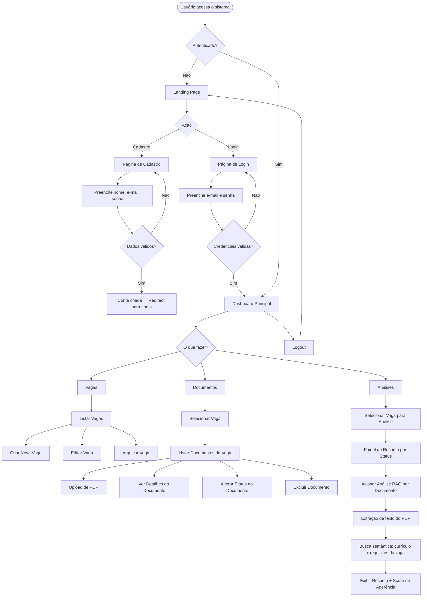
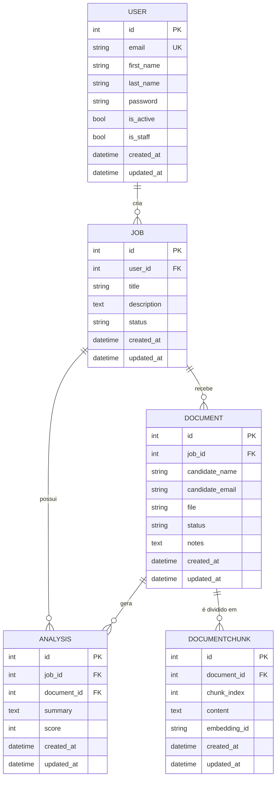

# PRD — Crivopy
### Sistema de Triagem de Currículos e Documentos PDF

> **Versão:** 1.1.0 — Documento vivo, atualizado conforme sprints avançam.

---

## 1. Visão Geral

O **Crivopy** é um sistema web de triagem inteligente de currículos e documentos PDF, desenvolvido com Django full stack. Oferece uma interface moderna, responsiva e com design system coeso, permitindo que recrutadores e gestores de RH organizem, analisem e filtrem candidatos com rapidez e precisão, sem depender de ferramentas externas dispersas.

---

## 2. Sobre o Produto

O Crivopy centraliza o fluxo de recebimento, organização e análise de currículos em PDF. O sistema permite que usuários autenticados façam upload de documentos, os associem a processos seletivos (vagas), e utilizem recursos de análise e filtragem com suporte de inteligência artificial via RAG (Retrieval-Augmented Generation) para identificar os candidatos mais aderentes ao perfil desejado. Toda a interface é em português brasileiro, com código-fonte em inglês seguindo padrões da PEP 8.

**Nome:** Crivopy
**Stack principal:** Python 3.13 + Django + SQLite + TailwindCSS
**Paradigma:** Full Stack, Server-Side Rendering com Django Template Language

---

## 3. Propósito

Simplificar e acelerar o processo de triagem de currículos para equipes de recrutamento, eliminando a dependência de planilhas, e-mails dispersos e ferramentas não integradas. O Crivopy oferece um único ambiente para receber, visualizar, classificar e filtrar documentos de candidatos, com uma experiência de uso intuitiva e visualmente agradável.

---

## 4. Público-Alvo

- Recrutadores e profissionais de RH em empresas de pequeno e médio porte
- Gestores que conduzem processos seletivos internamente
- Freelancers de recrutamento que gerenciam múltiplos clientes/vagas
- Startups e agências sem ferramentas de ATS dedicadas

---

## 5. Objetivos

- Oferecer um sistema simples, funcional e sem engenharia excessiva para triagem de currículos
- Permitir upload, visualização e organização de PDFs de candidatos por vaga
- Utilizar IA com RAG para auxiliar a triagem, extraindo e comparando informações dos currículos com os requisitos de cada vaga
- Fornecer autenticação segura baseada em e-mail
- Entregar uma interface moderna, responsiva e com identidade visual consistente
- Manter o código limpo, idiomático e de fácil manutenção

---

## 6. Requisitos Funcionais

### 6.1 Site Público (Landing Page)
- RF01 — Exibir página inicial com apresentação do produto
- RF02 — Disponibilizar botão de "Cadastre-se" na página inicial
- RF03 — Disponibilizar botão de "Entrar" (login) na página inicial
- RF04 — A página pública não exige autenticação

### 6.2 Autenticação
- RF05 — Cadastro de usuário com nome, e-mail e senha
- RF06 — Login via e-mail (não username)
- RF07 — Logout seguro com redirecionamento para a landing page
- RF08 — Proteção de rotas: usuários não autenticados são redirecionados para login

### 6.3 Dashboard
- RF09 — Exibir painel principal após login com resumo do sistema
- RF10 — Mostrar contagem de vagas ativas, documentos enviados e pendências

### 6.4 Gestão de Vagas (hub)
- RF11 — Criar nova vaga com título, descrição e status
- RF12 — Listar vagas do usuário
- RF13 — Editar dados de uma vaga
- RF14 — Arquivar/desativar vaga

### 6.5 Gestão de Documentos (documents)
- RF15 — Fazer upload de currículo PDF vinculado a uma vaga
- RF16 — Listar documentos por vaga
- RF17 — Visualizar detalhes do documento (nome do candidato, data de envio, status)
- RF18 — Excluir documento
- RF19 — Alterar status do documento (ex.: Em análise, Aprovado, Reprovado)

### 6.6 Análise / Brain (brain)
- RF20 — Exibir painel de análise dos documentos de uma vaga
- RF21 — Apresentar resumo dos status dos candidatos por vaga
- RF22 — Processar o texto extraído de cada currículo PDF e indexá-lo em uma base vetorial (RAG)
- RF23 — Comparar o conteúdo dos currículos indexados com os requisitos descritos na vaga via busca semântica
- RF24 — Gerar um resumo automático e uma pontuação de aderência para cada documento com base na análise RAG
- RF25 — Exibir o resultado da análise RAG (resumo + score) na tela de detalhes do documento

### 6.7 Chat (chat)
- RF26 — Estrutura base do módulo de chat preparada para expansão futura (sem funcionalidade na Sprint 1)

---

## 7. Flowchart — Fluxos de UX



---

## 8. Requisitos Não-Funcionais

- RNF01 — Interface totalmente responsiva (mobile, tablet, desktop)
- RNF02 — Tempo de resposta das páginas abaixo de 1s em condições normais
- RNF03 — Senhas armazenadas com hash seguro (nativo do Django)
- RNF04 — Código seguindo PEP 8, em inglês, com aspas simples
- RNF05 — Banco de dados SQLite (sem configuração adicional)
- RNF06 — Uso preferencial de Class-Based Views do Django
- RNF07 — Separação de responsabilidades por apps Django
- RNF08 — Signals em arquivo `signals.py` na app correspondente
- RNF09 — Todos os models com campos `created_at` e `updated_at`
- RNF10 — Sistema sem over-engineering; código simples e enxuto
- RNF11 — Docker e testes automatizados reservados para sprints finais
- RNF12 — Toda interface exibida em português brasileiro
- RNF13 — O pipeline RAG deve ser executado de forma assíncrona ou sob demanda, sem bloquear a interface do usuário
- RNF14 — Os embeddings e índice vetorial devem ser armazenados localmente (ex.: ChromaDB em disco), sem dependência de serviços externos pagos na fase inicial

---

## 9. Arquitetura Técnica

### 9.1 Stack

| Camada | Tecnologia |
|---|---|
| Linguagem | Python 3.13 |
| Framework Web | Django 5.x |
| Banco de Dados | SQLite (padrão Django) |
| Frontend | Django Template Language + TailwindCSS (via CDN) |
| Autenticação | Django Auth com backend customizado (email) |
| Armazenamento de Arquivos | Sistema de arquivos local (MEDIA_ROOT) |
| Extração de texto PDF | PyMuPDF (`fitz`) ou `pdfplumber` |
| Embeddings | Sentence Transformers (modelo local, ex.: `all-MiniLM-L6-v2`) |
| Banco Vetorial | ChromaDB (persistido em disco local) |
| Orquestração RAG | LangChain ou implementação direta com ChromaDB + Sentence Transformers |
| LLM para geração de resumo | API OpenAI (GPT-4o-mini) ou modelo local via Ollama |
| Servidor de Desenvolvimento | Django runserver |

### 9.2 Estrutura de Apps

```
Crivopy/
├── core/           → Configurações, URLs raiz, WSGI/ASGI
├── users/          → Modelo de usuário customizado, autenticação via e-mail
├── hub/            → Gestão de vagas/processos seletivos
├── documents/      → Upload e gestão de currículos PDF
├── brain/          → Análises e triagem dos documentos
└── chat/           → Módulo de chat (estrutura base)
```

---

## 10. Estrutura de Dados



### Status de Vaga (Job.status)
- `active` — Ativa
- `paused` — Pausada
- `archived` — Arquivada

### Status de Documento (Document.status)
- `pending` — Pendente
- `reviewing` — Em análise
- `approved` — Aprovado
- `rejected` — Reprovado

---

## 11. Design System

### 11.1 Identidade Visual

O Crivopy adota um visual **dark mode refinado**, com gradientes profundos em tons de índigo e violeta, superfícies com transparência e glassmorphism sutil, tipografia nítida e espaçamento generoso. A identidade transmite modernidade, confiança e precisão — valores centrais para um sistema de triagem profissional.

### 11.2 Paleta de Cores (TailwindCSS)

| Token | Classe Tailwind | Uso |
|---|---|---|
| Fundo principal | `bg-gray-950` | Body, páginas |
| Fundo de card | `bg-gray-900` | Cards, painéis |
| Fundo elevado | `bg-gray-800` | Inputs, dropdowns |
| Borda | `border-gray-700` | Divisores, bordas |
| Gradiente primário | `from-indigo-600 to-violet-600` | Botões, destaques |
| Gradiente hero | `from-indigo-900 via-gray-950 to-violet-900` | Seção hero da landing |
| Acento | `text-indigo-400` | Links ativos, labels |
| Acento hover | `text-violet-400` | Hover states |
| Texto principal | `text-gray-100` | Títulos, corpo |
| Texto secundário | `text-gray-400` | Labels, legendas |
| Sucesso | `text-emerald-400 / bg-emerald-500` | Status aprovado |
| Alerta | `text-amber-400 / bg-amber-500` | Status em análise |
| Erro | `text-red-400 / bg-red-500` | Status reprovado |
| Info | `text-blue-400 / bg-blue-500` | Status pendente |

### 11.3 Tipografia

- **Fonte principal:** `font-sans` com `font-family: 'Inter', system-ui` (via @import no base.html)
- **Títulos grandes:** `text-4xl font-bold tracking-tight text-gray-100`
- **Títulos de seção:** `text-2xl font-semibold text-gray-100`
- **Subtítulos:** `text-lg font-medium text-gray-200`
- **Corpo:** `text-base text-gray-300 leading-relaxed`
- **Labels/meta:** `text-sm text-gray-400`
- **Badges:** `text-xs font-semibold uppercase tracking-wider`

### 11.4 Botões

```html
<!-- Botão Primário -->
<button class="inline-flex items-center gap-2 px-5 py-2.5 rounded-xl
               bg-gradient-to-r from-indigo-600 to-violet-600
               text-white font-semibold text-sm
               hover:from-indigo-500 hover:to-violet-500
               focus:outline-none focus:ring-2 focus:ring-indigo-500 focus:ring-offset-2 focus:ring-offset-gray-950
               transition-all duration-200 shadow-lg shadow-indigo-900/40">
  Ação Principal
</button>

<!-- Botão Secundário -->
<button class="inline-flex items-center gap-2 px-5 py-2.5 rounded-xl
               bg-gray-800 border border-gray-700
               text-gray-200 font-semibold text-sm
               hover:bg-gray-700 hover:border-gray-600
               focus:outline-none focus:ring-2 focus:ring-gray-500
               transition-all duration-200">
  Ação Secundária
</button>

<!-- Botão Perigo -->
<button class="inline-flex items-center gap-2 px-5 py-2.5 rounded-xl
               bg-red-600/20 border border-red-500/30
               text-red-400 font-semibold text-sm
               hover:bg-red-600/30 hover:border-red-500/50
               transition-all duration-200">
  Excluir
</button>
```

### 11.5 Inputs e Forms

```html
<!-- Label -->
<label class="block text-sm font-medium text-gray-300 mb-1.5">
  Campo
</label>

<!-- Input -->
<input type="text"
       class="w-full px-4 py-2.5 rounded-xl
              bg-gray-800 border border-gray-700
              text-gray-100 placeholder-gray-500
              focus:outline-none focus:ring-2 focus:ring-indigo-500 focus:border-transparent
              transition-all duration-200">

<!-- Select -->
<select class="w-full px-4 py-2.5 rounded-xl
               bg-gray-800 border border-gray-700
               text-gray-100
               focus:outline-none focus:ring-2 focus:ring-indigo-500
               transition-all duration-200">

<!-- Textarea -->
<textarea class="w-full px-4 py-2.5 rounded-xl
                 bg-gray-800 border border-gray-700
                 text-gray-100 placeholder-gray-500
                 focus:outline-none focus:ring-2 focus:ring-indigo-500
                 resize-none transition-all duration-200">

<!-- Bloco de form com erro -->
<p class="mt-1.5 text-sm text-red-400">Mensagem de erro</p>
```

### 11.6 Cards

```html
<div class="bg-gray-900 border border-gray-800 rounded-2xl p-6
            hover:border-gray-700 transition-all duration-200
            shadow-xl shadow-black/20">
  <!-- conteúdo -->
</div>
```

### 11.7 Grid e Layout

- **Container principal:** `max-w-7xl mx-auto px-4 sm:px-6 lg:px-8`
- **Grid de cards:** `grid grid-cols-1 sm:grid-cols-2 lg:grid-cols-3 gap-6`
- **Grid de dashboard:** `grid grid-cols-1 md:grid-cols-2 xl:grid-cols-4 gap-4`
- **Sidebar + conteúdo:** `flex min-h-screen` com sidebar `w-64` e conteúdo `flex-1`

### 11.8 Navegação (Sidebar autenticada)

```html
<aside class="w-64 bg-gray-900 border-r border-gray-800 min-h-screen flex flex-col">
  <!-- Logo -->
  <div class="p-6 border-b border-gray-800">
    <span class="text-xl font-bold bg-gradient-to-r from-indigo-400 to-violet-400 bg-clip-text text-transparent">
      Crivopy
    </span>
  </div>
  <!-- Nav links -->
  <nav class="flex-1 p-4 space-y-1">
    <a href="#" class="flex items-center gap-3 px-3 py-2.5 rounded-xl
                       text-gray-300 hover:text-white hover:bg-gray-800
                       transition-all duration-150 text-sm font-medium">
      Dashboard
    </a>
    <!-- link ativo -->
    <a href="#" class="flex items-center gap-3 px-3 py-2.5 rounded-xl
                       text-white bg-indigo-600/20 border border-indigo-500/30
                       text-sm font-medium">
      Vagas
    </a>
  </nav>
</aside>
```

### 11.9 Badges de Status

```html
<!-- Pendente -->
<span class="inline-flex items-center px-2.5 py-0.5 rounded-full text-xs font-semibold
             bg-blue-500/10 text-blue-400 border border-blue-500/20">
  Pendente
</span>
<!-- Em análise -->
<span class="... bg-amber-500/10 text-amber-400 border border-amber-500/20">Em análise</span>
<!-- Aprovado -->
<span class="... bg-emerald-500/10 text-emerald-400 border border-emerald-500/20">Aprovado</span>
<!-- Reprovado -->
<span class="... bg-red-500/10 text-red-400 border border-red-500/20">Reprovado</span>
```

### 11.10 Template Base

Todos os templates herdam de `templates/base.html`, que inclui:
- `<meta charset>`, viewport, título dinâmico
- TailwindCSS via CDN com configuração de dark mode
- Inter font via Google Fonts
- Bloco ``
- Scripts no final do body via ``

---

## 12. User Stories

### Épico 1 — Acesso ao Sistema

**US-01 — Cadastro de conta**
Como visitante, quero me cadastrar com nome, e-mail e senha para ter acesso ao sistema.
**Critérios de aceite:**
- [ ] Formulário com campos: primeiro nome, sobrenome, e-mail, senha, confirmação de senha
- [ ] E-mail deve ser único no sistema
- [ ] Senha com mínimo de 8 caracteres
- [ ] Após cadastro, redirecionar para página de login com mensagem de sucesso
- [ ] Erros de validação exibidos inline no formulário

**US-02 — Login via e-mail**
Como usuário cadastrado, quero fazer login com meu e-mail e senha.
**Critérios de aceite:**
- [ ] Campo de login aceita e-mail (não username)
- [ ] Credenciais inválidas retornam mensagem de erro clara
- [ ] Após login, redirecionar para dashboard
- [ ] Sessão mantida entre navegações

**US-03 — Logout**
Como usuário autenticado, quero fazer logout para encerrar minha sessão com segurança.
**Critérios de aceite:**
- [ ] Botão de logout disponível na sidebar
- [ ] Após logout, redirecionar para landing page
- [ ] Sessão destruída completamente

### Épico 2 — Gestão de Vagas

**US-04 — Criar vaga**
Como usuário, quero criar uma vaga para organizar os currículos recebidos.
**Critérios de aceite:**
- [ ] Formulário com título (obrigatório), descrição e status inicial
- [ ] Vaga vinculada ao usuário logado
- [ ] Após criação, redirecionar para lista de vagas com mensagem de sucesso

**US-05 — Listar vagas**
Como usuário, quero ver todas as minhas vagas em uma lista organizada.
**Critérios de aceite:**
- [ ] Listar apenas vagas do usuário logado
- [ ] Exibir título, status e data de criação
- [ ] Opções de editar e arquivar por vaga

**US-06 — Editar vaga**
Como usuário, quero editar os dados de uma vaga existente.
**Critérios de aceite:**
- [ ] Formulário pré-preenchido com dados atuais
- [ ] Salvar alterações e redirecionar com mensagem de sucesso

**US-07 — Arquivar vaga**
Como usuário, quero arquivar uma vaga que não está mais ativa.
**Critérios de aceite:**
- [ ] Ação de arquivar altera status para `archived`
- [ ] Vagas arquivadas permanecem visíveis mas sinalizadas

### Épico 3 — Gestão de Documentos

**US-08 — Upload de currículo**
Como usuário, quero fazer upload de um currículo PDF vinculado a uma vaga.
**Critérios de aceite:**
- [ ] Campo de upload aceita somente PDF
- [ ] Campos: nome do candidato, e-mail do candidato (opcional), arquivo PDF
- [ ] Arquivo salvo no MEDIA_ROOT com nome único
- [ ] Status inicial definido como `pending`

**US-09 — Listar documentos por vaga**
Como usuário, quero ver todos os currículos de uma vaga específica.
**Critérios de aceite:**
- [ ] Lista filtrada pela vaga selecionada
- [ ] Exibir nome do candidato, data de envio e status
- [ ] Acesso apenas a documentos de vagas do próprio usuário

**US-10 — Alterar status do documento**
Como usuário, quero alterar o status de um currículo para indicar o resultado da triagem.
**Critérios de aceite:**
- [ ] Status disponíveis: Pendente, Em análise, Aprovado, Reprovado
- [ ] Alteração salva e refletida imediatamente na listagem

**US-11 — Excluir documento**
Como usuário, quero excluir um currículo que foi enviado por engano.
**Critérios de aceite:**
- [ ] Confirmação antes da exclusão
- [ ] Arquivo físico removido do servidor junto ao registro

### Épico 4 — Análise

**US-12 — Painel de análise por vaga**
Como usuário, quero ver um resumo dos candidatos de uma vaga agrupados por status.
**Critérios de aceite:**
- [ ] Exibir contagem de documentos por status
- [ ] Visual em cards ou gráfico simples

### Épico 5 — Triagem com IA (RAG)

**US-13 — Análise RAG de currículo**
Como usuário, quero acionar a análise de IA em um currículo para obter um resumo automático e uma pontuação de aderência ao perfil da vaga.
**Critérios de aceite:**
- [ ] Botão "Analisar com IA" disponível na listagem ou detalhe do documento
- [ ] O texto do PDF é extraído e dividido em chunks
- [ ] Os chunks são indexados no banco vetorial (ChromaDB)
- [ ] Os requisitos da descrição da vaga são usados como query na busca semântica
- [ ] Um resumo e um score (0–100) são gerados e salvos no model `Analysis`
- [ ] O resultado é exibido na interface sem necessidade de recarregar a página (ou com redirecionamento após processamento)
- [ ] Se o documento já foi analisado, exibir o resultado existente com opção de reanalisar

**US-14 — Visualizar resultado da análise RAG**
Como usuário, quero ver o resumo e a pontuação de aderência gerados pela IA para cada candidato.
**Critérios de aceite:**
- [ ] Score exibido como número e barra de progresso visual
- [ ] Resumo exibido em texto legível
- [ ] Data da última análise exibida

---

## 13. Métricas de Sucesso e KPIs

### KPIs de Produto
- Taxa de conversão visitante → cadastro (meta: > 15%)
- Número de vagas criadas por usuário (meta: ≥ 2 vagas/usuário ativo)
- Número de documentos enviados por vaga (meta: ≥ 5 docs/vaga)
- Taxa de vagas com ao menos 1 documento aprovado
- Taxa de documentos com análise RAG acionada (meta: > 70% dos documentos analisados)
- Correlação entre score RAG e status final definido pelo usuário (indicador de qualidade do modelo)

### KPIs de Usuário
- Tempo médio para triagem de um currículo (desde upload até mudança de status)
- Taxa de retenção semanal de usuários ativos
- Número de sessões por semana por usuário

### KPIs Técnicos
- Tempo de carregamento das páginas (meta: < 1s)
- Uptime do servidor (meta: > 99%)
- Taxa de erro 500 (meta: < 0,1%)

---

## 14. Riscos e Mitigações

| Risco | Probabilidade | Impacto | Mitigação |
|---|---|---|---|
| Upload de arquivos maliciosos | Média | Alto | Validar tipo MIME e extensão no backend; limitar tamanho de upload |
| Crescimento do banco SQLite em produção | Baixa | Médio | Monitorar tamanho; planejar migração para PostgreSQL em sprints avançadas |
| Acesso não autorizado a documentos | Baixa | Alto | Verificar `request.user` em todas as views protegidas |
| Acúmulo de arquivos órfãos no MEDIA_ROOT | Média | Baixo | Implementar exclusão física ao deletar Document |
| Complexidade crescente do sistema | Média | Médio | Manter foco no escopo definido; evitar features não solicitadas |
| Falha na autenticação por e-mail | Baixa | Alto | Testar backend customizado exaustivamente antes de avançar |
| Custo ou indisponibilidade da API LLM | Média | Médio | Permitir troca fácil entre provedor (OpenAI) e modelo local (Ollama); abstrair o cliente LLM em um serviço separado |
| Qualidade baixa da extração de texto de PDFs escaneados | Alta | Médio | Detectar PDFs baseados em imagem e alertar o usuário; planejar OCR (ex.: Tesseract) para sprints futuras |
| Tempo de processamento RAG longo bloqueando a UI | Média | Médio | Executar pipeline RAG de forma assíncrona (Celery ou thread simples) e exibir estado "processando" |
| Crescimento do índice ChromaDB em disco | Baixa | Baixo | Monitorar tamanho; implementar limpeza de chunks ao excluir documento |

---

## 15. Lista de Tarefas por Sprint

---

### SPRINT 0 — Configuração do Ambiente e Fundação

#### Tarefa 0.1 — Configuração inicial do projeto Django
- [X] **0.1.1** Verificar versão do Python instalada (`python --version`) e confirmar Python 3.13
- [X] **0.1.2** Criar e ativar ambiente virtual (`python -m venv .venv`)
- [X] **0.1.3** Instalar Django (`pip install django`)
- [X] **0.1.4** Confirmar que o projeto Django já existe com a estrutura de diretórios especificada
- [X] **0.1.5** Criar arquivo `requirements.txt` com as dependências iniciais (`Django`, `Pillow`)

#### Tarefa 0.2 — Configuração do `settings.py`
- [ ] **0.2.1** Definir `LANGUAGE_CODE = 'pt-br'` e `TIME_ZONE = 'America/Sao_Paulo'`
- [ ] **0.2.2** Adicionar todas as apps ao `INSTALLED_APPS`: `users`, `hub`, `documents`, `brain`, `chat`
- [ ] **0.2.3** Configurar `MEDIA_URL = '/media/'` e `MEDIA_ROOT = BASE_DIR / 'media'`
- [ ] **0.2.4** Configurar `STATIC_URL = '/static/'` e `STATICFILES_DIRS`
- [ ] **0.2.5** Definir `AUTH_USER_MODEL = 'users.User'`
- [ ] **0.2.6** Definir `AUTHENTICATION_BACKENDS = ['users.backends.EmailBackend']`
- [ ] **0.2.7** Definir `LOGIN_URL`, `LOGIN_REDIRECT_URL` e `LOGOUT_REDIRECT_URL`
- [ ] **0.2.8** Configurar `TEMPLATES` com `DIRS` apontando para `templates/` na raiz do projeto
- [ ] **0.2.9** Definir `DEFAULT_AUTO_FIELD = 'django.db.models.BigAutoField'`

#### Tarefa 0.3 — Estrutura de templates e arquivos estáticos
- [ ] **0.3.1** Criar diretório `templates/` na raiz do projeto
- [ ] **0.3.2** Criar subdiretórios: `templates/users/`, `templates/hub/`, `templates/documents/`, `templates/brain/`, `templates/public/`
- [ ] **0.3.3** Criar diretório `static/` na raiz do projeto
- [ ] **0.3.4** Criar arquivo `templates/base.html` com estrutura HTML base, import do TailwindCSS (CDN) e fonte Inter
- [ ] **0.3.5** Criar arquivo `templates/partials/_sidebar.html` com navegação autenticada
- [ ] **0.3.6** Criar arquivo `templates/partials/_navbar_public.html` para navbar da landing page
- [ ] **0.3.7** Criar arquivo `templates/partials/_messages.html` para exibição de mensagens Django

#### Tarefa 0.4 — Configuração do `core/urls.py`
- [ ] **0.4.1** Configurar `urlpatterns` raiz incluindo `users.urls`, `hub.urls`, `documents.urls`, `brain.urls`
- [ ] **0.4.2** Adicionar rota para a landing page (`/`) apontando para view da app `users` ou `public`
- [ ] **0.4.3** Adicionar `+ static(settings.MEDIA_URL, document_root=settings.MEDIA_ROOT)` para servir arquivos de mídia em desenvolvimento

---

### SPRINT 1 — Autenticação e Usuários

#### Tarefa 1.1 — Model de usuário customizado (`users/models.py`)
- [ ] **1.1.1** Criar classe `User` herdando de `AbstractBaseUser` e `PermissionsMixin`
- [ ] **1.1.2** Definir campo `email` como `EmailField(unique=True)` — identificador principal
- [ ] **1.1.3** Definir campos `first_name` e `last_name` como `CharField`
- [ ] **1.1.4** Definir campo `is_active` com `default=True`
- [ ] **1.1.5** Definir campo `is_staff` com `default=False`
- [ ] **1.1.6** Definir campos `created_at = models.DateTimeField(auto_now_add=True)` e `updated_at = models.DateTimeField(auto_now=True)`
- [ ] **1.1.7** Definir `USERNAME_FIELD = 'email'` e `REQUIRED_FIELDS = ['first_name', 'last_name']`
- [ ] **1.1.8** Criar classe `UserManager` herdando de `BaseUserManager` com métodos `create_user` e `create_superuser`
- [ ] **1.1.9** Implementar método `__str__` retornando `self.email`

#### Tarefa 1.2 — Backend de autenticação por e-mail (`users/backends.py`)
- [ ] **1.2.1** Criar arquivo `users/backends.py`
- [ ] **1.2.2** Criar classe `EmailBackend` herdando de `ModelBackend`
- [ ] **1.2.3** Sobrescrever método `authenticate(request, email=None, password=None, **kwargs)`
- [ ] **1.2.4** Buscar usuário pelo campo `email` e validar senha com `user.check_password(password)`
- [ ] **1.2.5** Retornar `None` se usuário não encontrado ou senha inválida

#### Tarefa 1.3 — Forms de autenticação (`users/forms.py`)
- [ ] **1.3.1** Criar arquivo `users/forms.py`
- [ ] **1.3.2** Criar `RegisterForm` herdando de `forms.ModelForm` com campos `first_name`, `last_name`, `email`, `password`, `password_confirm`
- [ ] **1.3.3** Implementar validação de `clean_password_confirm` verificando se senhas conferem
- [ ] **1.3.4** Implementar `save(commit=True)` chamando `set_password` para hash seguro
- [ ] **1.3.5** Criar `LoginForm` herdando de `forms.Form` com campos `email` e `password`
- [ ] **1.3.6** Adicionar classes CSS do design system em cada widget dos forms via `attrs`

#### Tarefa 1.4 — Views de autenticação (`users/views.py`)
- [ ] **1.4.1** Criar `RegisterView` como `FormView` com `form_class = RegisterForm`
- [ ] **1.4.2** Implementar `form_valid` salvando o usuário e redirecionando para login com `messages.success`
- [ ] **1.4.3** Criar `LoginView` como `FormView` com `form_class = LoginForm`
- [ ] **1.4.4** Implementar `form_valid` chamando `authenticate` e `login` do Django
- [ ] **1.4.5** Redirecionar para dashboard em caso de sucesso; retornar erro no form em caso de falha
- [ ] **1.4.6** Criar `LogoutView` como `View` com método `post` chamando `logout` e redirecionando para `/`
- [ ] **1.4.7** Criar `LandingPageView` como `TemplateView` com `template_name = 'public/landing.html'`

#### Tarefa 1.5 — URLs de usuários (`users/urls.py`)
- [ ] **1.5.1** Criar arquivo `users/urls.py`
- [ ] **1.5.2** Definir rota `''` para `LandingPageView` com nome `landing`
- [ ] **1.5.3** Definir rota `'cadastro/'` para `RegisterView` com nome `register`
- [ ] **1.5.4** Definir rota `'entrar/'` para `LoginView` com nome `login`
- [ ] **1.5.5** Definir rota `'sair/'` para `LogoutView` com nome `logout`

#### Tarefa 1.6 — Templates de autenticação
- [ ] **1.6.1** Criar `templates/public/landing.html` com seção hero, gradiente, botões "Cadastre-se" e "Entrar", e apresentação do produto
- [ ] **1.6.2** Criar `templates/users/register.html` com formulário de cadastro centralizado, design dark, logo Crivopy e link para login
- [ ] **1.6.3** Criar `templates/users/login.html` com formulário de login centralizado, design dark, logo Crivopy e link para cadastro
- [ ] **1.6.4** Garantir que mensagens Django (``) sejam renderizadas em todos os templates

#### Tarefa 1.7 — Admin (`users/admin.py`)
- [ ] **1.7.1** Registrar model `User` no admin com `UserAdmin` customizado
- [ ] **1.7.2** Configurar `list_display = ['email', 'first_name', 'last_name', 'is_active', 'created_at']`

#### Tarefa 1.8 — Migrations e validação
- [ ] **1.8.1** Executar `python manage.py makemigrations users`
- [ ] **1.8.2** Executar `python manage.py migrate`
- [ ] **1.8.3** Criar superusuário de teste com `python manage.py createsuperuser`
- [ ] **1.8.4** Testar cadastro, login e logout manualmente no browser
- [ ] **1.8.5** Verificar que rotas protegidas redirecionam para `/entrar/` quando não autenticado

---

### SPRINT 2 — Dashboard e Estrutura Autenticada

#### Tarefa 2.1 — Template base autenticado
- [ ] **2.1.1** Criar `templates/base_authenticated.html` herdando de `base.html` com layout sidebar + conteúdo
- [ ] **2.1.2** Incluir `` no layout
- [ ] **2.1.3** Sidebar deve conter: logo Crivopy, links de navegação (Dashboard, Vagas, Documentos, Análises), informações do usuário logado e botão de logout
- [ ] **2.1.4** Adicionar indicador visual de item ativo na sidebar usando template tags do Django (`` comparado a `request.path`)
- [ ] **2.1.5** Tornar o layout responsivo: sidebar colapsável via checkbox CSS ou `hidden md:flex`

#### Tarefa 2.2 — Dashboard view e template
- [ ] **2.2.1** Criar view `DashboardView` como `LoginRequiredMixin` + `TemplateView` na app `hub`
- [ ] **2.2.2** Sobrescrever `get_context_data` para injetar contagem de vagas ativas, total de documentos e documentos pendentes do usuário logado
- [ ] **2.2.3** Criar rota `'dashboard/'` em `hub/urls.py` com nome `dashboard`
- [ ] **2.2.4** Criar `templates/hub/dashboard.html` herdando de `base_authenticated.html`
- [ ] **2.2.5** Exibir cards de resumo com métricas (vagas ativas, documentos enviados, pendentes, aprovados)
- [ ] **2.2.6** Design dos cards: gradiente sutil, ícone representativo, número em destaque, label descritiva

#### Tarefa 2.3 — Proteção de rotas
- [ ] **2.3.1** Confirmar que `LoginRequiredMixin` está aplicado em todas as views autenticadas
- [ ] **2.3.2** Verificar que `settings.LOGIN_URL` aponta para a view de login correta
- [ ] **2.3.3** Testar acesso direto a `/dashboard/` sem autenticação e confirmar redirecionamento

---

### SPRINT 3 — Gestão de Vagas (hub)

#### Tarefa 3.1 — Model de Vaga (`hub/models.py`)
- [ ] **3.1.1** Criar classe `Job` herdando de `models.Model`
- [ ] **3.1.2** Definir `user = models.ForeignKey(settings.AUTH_USER_MODEL, on_delete=models.CASCADE, related_name='jobs')`
- [ ] **3.1.3** Definir `title = models.CharField(max_length=255)`
- [ ] **3.1.4** Definir `description = models.TextField(blank=True)`
- [ ] **3.1.5** Definir constantes de status: `ACTIVE`, `PAUSED`, `ARCHIVED` e campo `status = models.CharField(choices=..., default=ACTIVE)`
- [ ] **3.1.6** Definir `created_at` e `updated_at` com `auto_now_add` e `auto_now`
- [ ] **3.1.7** Implementar `__str__` retornando `self.title`
- [ ] **3.1.8** Adicionar `class Meta` com `ordering = ['-created_at']`

#### Tarefa 3.2 — Form de Vaga (`hub/forms.py`)
- [ ] **3.2.1** Criar arquivo `hub/forms.py`
- [ ] **3.2.2** Criar `JobForm` como `ModelForm` com campos `title`, `description`, `status`
- [ ] **3.2.3** Aplicar classes CSS do design system nos widgets

#### Tarefa 3.3 — Views de Vaga (`hub/views.py`)
- [ ] **3.3.1** Criar `JobListView` como `LoginRequiredMixin` + `ListView` com `model = Job` e `template_name = 'hub/job_list.html'`
- [ ] **3.3.2** Sobrescrever `get_queryset` para filtrar apenas vagas do `request.user`
- [ ] **3.3.3** Criar `JobCreateView` como `LoginRequiredMixin` + `CreateView` com `form_class = JobForm`
- [ ] **3.3.4** Sobrescrever `form_valid` para setar `form.instance.user = self.request.user`
- [ ] **3.3.5** Criar `JobUpdateView` como `LoginRequiredMixin` + `UpdateView` com `form_class = JobForm`
- [ ] **3.3.6** Sobrescrever `get_queryset` para garantir que o usuário só edita suas próprias vagas
- [ ] **3.3.7** Criar `JobArchiveView` como `LoginRequiredMixin` + `View` com método `post` alterando status para `archived`
- [ ] **3.3.8** Adicionar `messages.success` em todas as ações de criação, edição e arquivamento

#### Tarefa 3.4 — URLs de Vaga (`hub/urls.py`)
- [ ] **3.4.1** Criar arquivo `hub/urls.py`
- [ ] **3.4.2** Rota `'vagas/'` → `JobListView` → nome `job-list`
- [ ] **3.4.3** Rota `'vagas/nova/'` → `JobCreateView` → nome `job-create`
- [ ] **3.4.4** Rota `'vagas/<int:pk>/editar/'` → `JobUpdateView` → nome `job-update`
- [ ] **3.4.5** Rota `'vagas/<int:pk>/arquivar/'` → `JobArchiveView` → nome `job-archive`

#### Tarefa 3.5 — Templates de Vaga
- [ ] **3.5.1** Criar `templates/hub/job_list.html` com tabela ou grid de cards de vagas, badge de status colorido e botões de ação
- [ ] **3.5.2** Criar `templates/hub/job_form.html` reutilizável para criação e edição de vaga
- [ ] **3.5.3** Adicionar mensagem de estado vazio quando não há vagas cadastradas
- [ ] **3.5.4** Adicionar botão "Nova Vaga" em destaque na listagem

#### Tarefa 3.6 — Admin (`hub/admin.py`)
- [ ] **3.6.1** Registrar model `Job` no admin
- [ ] **3.6.2** Configurar `list_display = ['title', 'user', 'status', 'created_at']`
- [ ] **3.6.3** Adicionar `list_filter = ['status']` e `search_fields = ['title']`

#### Tarefa 3.7 — Migrations
- [ ] **3.7.1** Executar `python manage.py makemigrations hub`
- [ ] **3.7.2** Executar `python manage.py migrate`
- [ ] **3.7.3** Testar CRUD de vagas manualmente

---

### SPRINT 4 — Gestão de Documentos

#### Tarefa 4.1 — Model de Documento (`documents/models.py`)
- [ ] **4.1.1** Criar classe `Document` herdando de `models.Model`
- [ ] **4.1.2** Definir `job = models.ForeignKey('hub.Job', on_delete=models.CASCADE, related_name='documents')`
- [ ] **4.1.3** Definir `candidate_name = models.CharField(max_length=255)`
- [ ] **4.1.4** Definir `candidate_email = models.EmailField(blank=True)`
- [ ] **4.1.5** Definir `file = models.FileField(upload_to='documents/%Y/%m/')` — organiza por ano/mês
- [ ] **4.1.6** Definir constantes de status: `PENDING`, `REVIEWING`, `APPROVED`, `REJECTED` e campo `status`
- [ ] **4.1.7** Definir `notes = models.TextField(blank=True)`
- [ ] **4.1.8** Definir `created_at` e `updated_at`
- [ ] **4.1.9** Implementar `__str__` retornando `self.candidate_name`
- [ ] **4.1.10** Adicionar `class Meta` com `ordering = ['-created_at']`

#### Tarefa 4.2 — Signals para limpeza de arquivo (`documents/signals.py`)
- [ ] **4.2.1** Criar arquivo `documents/signals.py`
- [ ] **4.2.2** Implementar signal `post_delete` no model `Document` para remover o arquivo físico do servidor quando o registro é deletado
- [ ] **4.2.3** Conectar o signal no `documents/apps.py` dentro do método `ready()`

#### Tarefa 4.3 — Form de Documento (`documents/forms.py`)
- [ ] **4.3.1** Criar arquivo `documents/forms.py`
- [ ] **4.3.2** Criar `DocumentUploadForm` como `ModelForm` com campos `candidate_name`, `candidate_email`, `file`, `notes`
- [ ] **4.3.3** Implementar validação do campo `file` para aceitar apenas arquivos com extensão `.pdf` e tipo MIME `application/pdf`
- [ ] **4.3.4** Aplicar classes CSS do design system nos widgets
- [ ] **4.3.5** Criar `DocumentStatusForm` como `ModelForm` apenas com o campo `status`

#### Tarefa 4.4 — Views de Documento (`documents/views.py`)
- [ ] **4.4.1** Criar `DocumentListView` como `LoginRequiredMixin` + `ListView` filtrada por `job_id` da URL e validando que a vaga pertence ao `request.user`
- [ ] **4.4.2** Injetar objeto `job` no contexto para exibir título da vaga no template
- [ ] **4.4.3** Criar `DocumentUploadView` como `LoginRequiredMixin` + `CreateView` com `form_class = DocumentUploadForm`
- [ ] **4.4.4** Sobrescrever `form_valid` para setar `form.instance.job_id` a partir do `pk` da URL
- [ ] **4.4.5** Validar que o `job` pertence ao `request.user` antes de permitir upload
- [ ] **4.4.6** Criar `DocumentStatusUpdateView` como `LoginRequiredMixin` + `UpdateView` com `form_class = DocumentStatusForm`
- [ ] **4.4.7** Validar que o documento pertence a uma vaga do `request.user`
- [ ] **4.4.8** Criar `DocumentDeleteView` como `LoginRequiredMixin` + `DeleteView`
- [ ] **4.4.9** Sobrescrever `get_queryset` para segurança — apenas documentos de vagas do usuário

#### Tarefa 4.5 — URLs de Documento (`documents/urls.py`)
- [ ] **4.5.1** Criar arquivo `documents/urls.py`
- [ ] **4.5.2** Rota `'vagas/<int:job_pk>/documentos/'` → `DocumentListView` → nome `document-list`
- [ ] **4.5.3** Rota `'vagas/<int:job_pk>/documentos/upload/'` → `DocumentUploadView` → nome `document-upload`
- [ ] **4.5.4** Rota `'documentos/<int:pk>/status/'` → `DocumentStatusUpdateView` → nome `document-status`
- [ ] **4.5.5** Rota `'documentos/<int:pk>/excluir/'` → `DocumentDeleteView` → nome `document-delete`

#### Tarefa 4.6 — Templates de Documento
- [ ] **4.6.1** Criar `templates/documents/document_list.html` com listagem de documentos em tabela ou cards, exibindo nome, e-mail, status badge e data
- [ ] **4.6.2** Adicionar link para download/visualização do PDF em nova aba
- [ ] **4.6.3** Criar `templates/documents/document_upload.html` com formulário de upload com área de drag-and-drop visual (CSS only)
- [ ] **4.6.4** Criar `templates/documents/document_confirm_delete.html` com mensagem de confirmação e botões de cancelar/confirmar
- [ ] **4.6.5** Criar `templates/documents/document_status_form.html` com select de status

#### Tarefa 4.7 — Admin (`documents/admin.py`)
- [ ] **4.7.1** Registrar model `Document` no admin
- [ ] **4.7.2** Configurar `list_display`, `list_filter` por status e `search_fields` por nome do candidato

#### Tarefa 4.8 — Migrations
- [ ] **4.8.1** Executar `python manage.py makemigrations documents`
- [ ] **4.8.2** Executar `python manage.py migrate`
- [ ] **4.8.3** Testar upload, listagem, mudança de status e exclusão manualmente

---

### SPRINT 5 — Módulo de Análise (brain)

#### Tarefa 5.1 — Model de Análise (`brain/models.py`)
- [ ] **5.1.1** Criar classe `Analysis` herdando de `models.Model`
- [ ] **5.1.2** Definir `job = models.ForeignKey('hub.Job', on_delete=models.CASCADE, related_name='analyses')`
- [ ] **5.1.3** Definir `document = models.ForeignKey('documents.Document', on_delete=models.CASCADE, related_name='analyses')`
- [ ] **5.1.4** Definir `summary = models.TextField(blank=True)`
- [ ] **5.1.5** Definir `score = models.IntegerField(null=True, blank=True)` — pontuação 0-100 para uso futuro
- [ ] **5.1.6** Definir `created_at` e `updated_at`

#### Tarefa 5.2 — Painel de Análise por Vaga (`brain/views.py`)
- [ ] **5.2.1** Criar `JobAnalysisView` como `LoginRequiredMixin` + `DetailView` com model `Job`
- [ ] **5.2.2** Sobrescrever `get_queryset` para filtrar apenas vagas do `request.user`
- [ ] **5.2.3** Sobrescrever `get_context_data` para injetar contagem de documentos agrupados por status usando `documents.values('status').annotate(count=Count('id'))`
- [ ] **5.2.4** Injetar lista dos documentos aprovados e em análise no contexto

#### Tarefa 5.3 — URLs de Análise (`brain/urls.py`)
- [ ] **5.3.1** Criar arquivo `brain/urls.py`
- [ ] **5.3.2** Rota `'vagas/<int:pk>/analise/'` → `JobAnalysisView` → nome `job-analysis`

#### Tarefa 5.4 — Template de Análise
- [ ] **5.4.1** Criar `templates/brain/job_analysis.html` herdando de `base_authenticated.html`
- [ ] **5.4.2** Exibir título da vaga e cards de contagem por status (Pendentes, Em análise, Aprovados, Reprovados)
- [ ] **5.4.3** Exibir tabela ou lista dos documentos aprovados em destaque

#### Tarefa 5.5 — Admin (`brain/admin.py`)
- [ ] **5.5.1** Registrar model `Analysis` no admin

#### Tarefa 5.6 — Migrations
- [ ] **5.6.1** Executar `python manage.py makemigrations brain`
- [ ] **5.6.2** Executar `python manage.py migrate`

---

### SPRINT 5B — Pipeline RAG (brain)

#### Tarefa 5B.1 — Dependências RAG
- [ ] **5B.1.1** Adicionar ao `requirements.txt`: `pymupdf` (ou `pdfplumber`), `sentence-transformers`, `chromadb`, `langchain` (opcional), `openai` (opcional)
- [ ] **5B.1.2** Executar `pip install` das novas dependências e confirmar sem conflitos
- [ ] **5B.1.3** Definir no `settings.py` as configurações do RAG: `CHROMA_DB_PATH = BASE_DIR / 'chroma_db'`, `LLM_PROVIDER` e `OPENAI_API_KEY` (via variável de ambiente)

#### Tarefa 5B.2 — Serviço de extração de texto (`brain/services/pdf_extractor.py`)
- [ ] **5B.2.1** Criar diretório `brain/services/` com arquivo `__init__.py`
- [ ] **5B.2.2** Criar arquivo `brain/services/pdf_extractor.py`
- [ ] **5B.2.3** Implementar função `extract_text_from_pdf(file_path: str) -> str` usando PyMuPDF (`fitz.open`)
- [ ] **5B.2.4** Implementar função `split_into_chunks(text: str, chunk_size: int = 500, overlap: int = 50) -> list[str]` para dividir o texto em chunks com sobreposição
- [ ] **5B.2.5** Tratar exceção para PDFs baseados em imagem (texto vazio) retornando string vazia e logando aviso

#### Tarefa 5B.3 — Serviço de embeddings e índice vetorial (`brain/services/vector_store.py`)
- [ ] **5B.3.1** Criar arquivo `brain/services/vector_store.py`
- [ ] **5B.3.2** Inicializar cliente ChromaDB persistido em `settings.CHROMA_DB_PATH`
- [ ] **5B.3.3** Implementar função `get_or_create_collection(collection_name: str)` retornando coleção ChromaDB
- [ ] **5B.3.4** Implementar função `index_document_chunks(document_id: int, chunks: list[str])` gerando embeddings com Sentence Transformers e adicionando ao ChromaDB com metadado `document_id`
- [ ] **5B.3.5** Implementar função `search_similar_chunks(query: str, document_id: int, n_results: int = 5) -> list[str]` buscando chunks semanticamente similares filtrando pelo `document_id`
- [ ] **5B.3.6** Implementar função `delete_document_chunks(document_id: int)` removendo todos os chunks de um documento do índice

#### Tarefa 5B.4 — Serviço de geração de análise (`brain/services/rag_pipeline.py`)
- [ ] **5B.4.1** Criar arquivo `brain/services/rag_pipeline.py`
- [ ] **5B.4.2** Implementar função `build_prompt(job_description: str, relevant_chunks: list[str]) -> str` montando o prompt com os requisitos da vaga e os trechos relevantes do currículo
- [ ] **5B.4.3** Implementar função `call_llm(prompt: str) -> str` chamando a API OpenAI (GPT-4o-mini) ou modelo local, retornando texto gerado
- [ ] **5B.4.4** Implementar função `parse_llm_response(response: str) -> dict` extraindo `summary` e `score` (0–100) do texto retornado pelo LLM (usar formato JSON estruturado no prompt)
- [ ] **5B.4.5** Implementar função principal `run_rag_analysis(document_id: int, job_id: int) -> dict` orquestrando todo o pipeline: extração → chunking → indexação → busca → geração → parse → retorno

#### Tarefa 5B.5 — Integração do RAG ao model Analysis (`brain/models.py`)
- [ ] **5B.5.1** Confirmar que `Analysis` possui campos `summary`, `score`, `created_at` e `updated_at` suficientes para armazenar o resultado RAG
- [ ] **5B.5.2** Adicionar campo `rag_status = models.CharField(choices=[...], default='pending')` com estados: `pending`, `processing`, `done`, `error`
- [ ] **5B.5.3** Adicionar campo `error_message = models.TextField(blank=True)` para registrar falhas do pipeline

#### Tarefa 5B.6 — Model DocumentChunk (`brain/models.py`)
- [ ] **5B.6.1** Criar classe `DocumentChunk` com `document` (FK), `chunk_index` (int), `content` (TextField), `embedding_id` (CharField — ID no ChromaDB), `created_at`, `updated_at`
- [ ] **5B.6.2** Executar `python manage.py makemigrations brain` e `migrate`

#### Tarefa 5B.7 — Signal para limpeza de chunks ao excluir documento (`documents/signals.py`)
- [ ] **5B.7.1** Adicionar ao `documents/signals.py` um signal `post_delete` que chama `delete_document_chunks(document_id)` do `vector_store` ao excluir um `Document`
- [ ] **5B.7.2** Garantir que o signal está conectado no `documents/apps.py`

#### Tarefa 5B.8 — View para acionar análise RAG (`brain/views.py`)
- [ ] **5B.8.1** Criar `DocumentAnalysisView` como `LoginRequiredMixin` + `View` com método `post`
- [ ] **5B.8.2** Receber `document_id` da URL, validar que pertence a uma vaga do `request.user`
- [ ] **5B.8.3** Criar ou atualizar registro `Analysis` com `rag_status = 'processing'`
- [ ] **5B.8.4** Chamar `run_rag_analysis(document_id, job_id)` e salvar resultado no `Analysis`
- [ ] **5B.8.5** Atualizar `rag_status` para `done` em caso de sucesso ou `error` em caso de exceção, salvando `error_message`
- [ ] **5B.8.6** Redirecionar para página de detalhe/listagem com mensagem de sucesso ou erro

#### Tarefa 5B.9 — Rota para análise RAG (`brain/urls.py`)
- [ ] **5B.9.1** Adicionar rota `'documentos/<int:document_pk>/analisar/'` → `DocumentAnalysisView` → nome `document-analyze`

#### Tarefa 5B.10 — Exibição do resultado RAG nos templates
- [ ] **5B.10.1** Na listagem de documentos (`document_list.html`), adicionar botão "Analisar com IA" por documento
- [ ] **5B.10.2** Exibir score como barra de progresso visual (div com largura proporcional ao score, colorida por faixa: vermelho < 40, amarelo 40–70, verde > 70)
- [ ] **5B.10.3** Exibir o campo `summary` do `Analysis` em um bloco colapsável ou card abaixo do documento
- [ ] **5B.10.4** Exibir `rag_status` como badge (Pendente, Processando, Concluído, Erro)
- [ ] **5B.10.5** Atualizar template de análise por vaga (`job_analysis.html`) para incluir ranking de candidatos por score RAG

---

### SPRINT 6 — Refinamentos de UI e Ajustes Finais

#### Tarefa 6.1 — Refinamento do Design System
- [ ] **6.1.1** Revisar todos os templates e garantir consistência visual com o design system definido
- [ ] **6.1.2** Garantir que todos os badges de status usam as cores corretas do design system
- [ ] **6.1.3** Revisar responsividade em todos os templates (mobile, tablet, desktop)
- [ ] **6.1.4** Adicionar transições CSS (`transition-all duration-200`) em todos os elementos interativos
- [ ] **6.1.5** Verificar acessibilidade básica: labels associados a inputs, contraste de cores mínimo

#### Tarefa 6.2 — Mensagens e Feedbacks
- [ ] **6.2.1** Garantir que mensagens Django (`messages.success`, `messages.error`) são exibidas em todas as ações
- [ ] **6.2.2** Estilizar o partial `_messages.html` com alertas coloridos e ícones correspondentes ao tipo (sucesso, erro, aviso)
- [ ] **6.2.3** Adicionar estados vazios ("Nenhuma vaga cadastrada", "Nenhum documento enviado") com ilustração ou ícone

#### Tarefa 6.3 — Segurança e Validações
- [ ] **6.3.1** Confirmar que `` está em todos os formulários POST
- [ ] **6.3.2** Confirmar que nenhum endpoint permite acesso a dados de outro usuário
- [ ] **6.3.3** Definir `FILE_UPLOAD_MAX_MEMORY_SIZE` e `DATA_UPLOAD_MAX_MEMORY_SIZE` no `settings.py` para limitar tamanho de upload
- [ ] **6.3.4** Adicionar `MAX_UPLOAD_SIZE` customizado e validar no form

#### Tarefa 6.4 — Estrutura do módulo Chat
- [ ] **6.4.1** Criar model placeholder `ChatMessage` em `chat/models.py` com `created_at` e `updated_at` (sem funcionalidade ainda)
- [ ] **6.4.2** Registrar no admin para fins de visibilidade futura

#### Tarefa 6.5 — Documentação do projeto
- [ ] **6.5.1** Criar `README.md` na raiz do projeto com instrução de setup (`git clone`, `venv`, `pip install`, `migrate`, `runserver`)
- [ ] **6.5.2** Documentar variáveis de ambiente importantes
- [ ] **6.5.3** Documentar estrutura de apps e responsabilidades de cada uma

---

### SPRINT FINAL A — Docker (futura)
- [ ] **A.1** Criar `Dockerfile` para a aplicação Django
- [ ] **A.2** Criar `docker-compose.yml` com serviço web
- [ ] **A.3** Configurar variáveis de ambiente via `.env`
- [ ] **A.4** Testar build e execução do container

### SPRINT FINAL B — Testes Automatizados (futura)
- [ ] **B.1** Configurar `pytest-django` ou Django TestCase
- [ ] **B.2** Escrever testes unitários para models (`User`, `Job`, `Document`)
- [ ] **B.3** Escrever testes de integração para views de autenticação
- [ ] **B.4** Escrever testes de integração para CRUD de vagas e documentos
- [ ] **B.5** Configurar GitHub Actions para CI

---

*Documento atualizado em: Abril/2026 — Crivopy v1.1.0 (adicionado suporte a IA RAG)*
